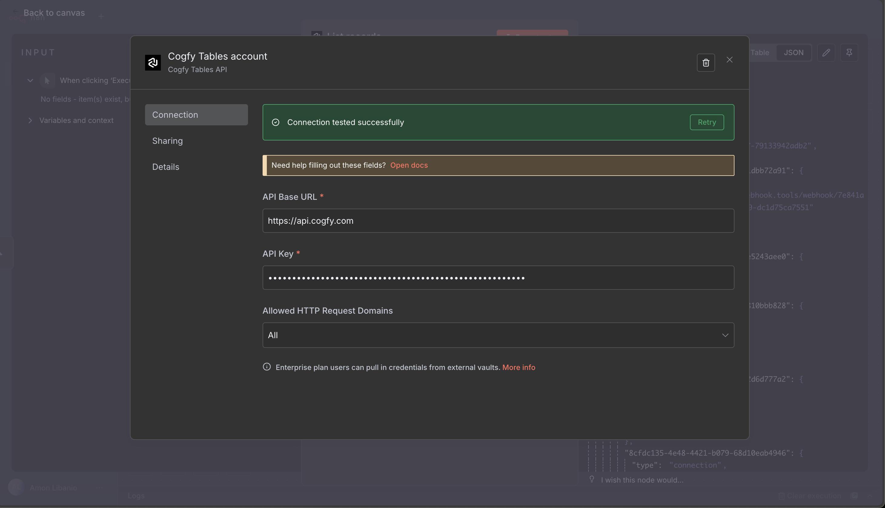
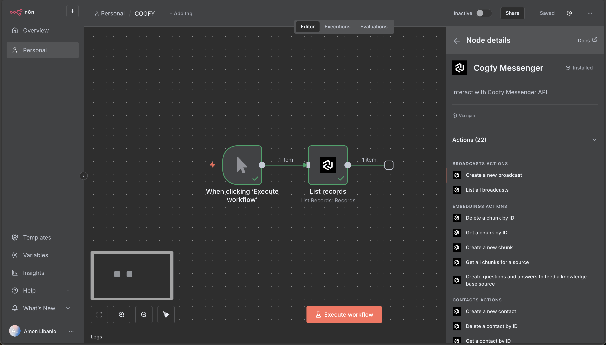
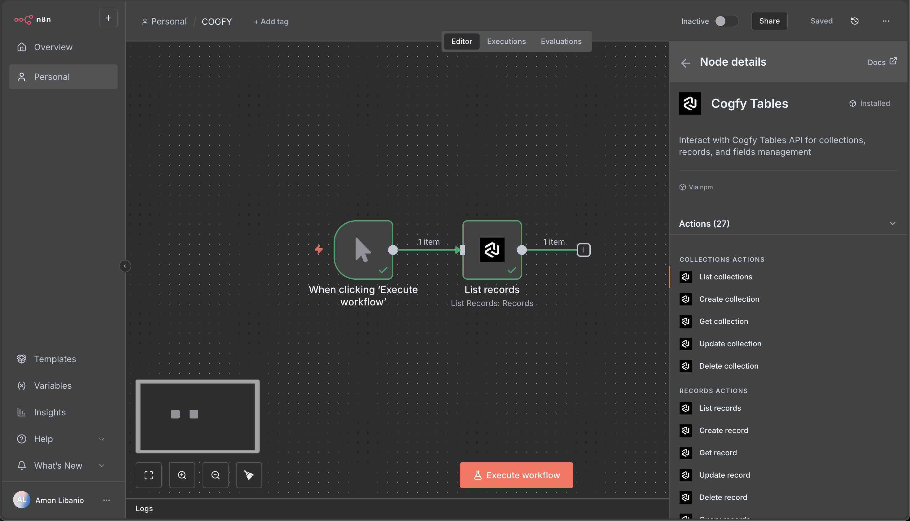

# n8n Cogfy Nodes

[](https://github.com/amonlibanio/n8n-nodes-cogfy/actions/workflows/publish.yaml)

<p align="center">
  
</p>

n8n community nodes for Cogfy integration.

## Contents

- [Installation](#installation)
- [Usage](#usage)
- [Screenshots](#screenshots)
- [Development](#development)

## Installation

Install the community node package in your n8n instance:

```
@amonlibanio/n8n-nodes-cogfy
```

## Usage

1. Install the package in your n8n instance
2. Add Cogfy API credentials in n8n
3. Create workflows using the Cogfy nodes:
   - **CogfyMessenger** - For messaging operations
   - **CogfyTables** - For database operations

## Screenshots

### Credentials Setup
<p align="center">
  
</p>

### CogfyMessenger Node
<p align="center">
  
</p>

### CogfyTables Node
<p align="center">
  
</p>

## Development

```bash
# Install dependencies
npm install

# Build the project
npm run build

# Run tests
npm test

# Development mode
npm run dev
```
